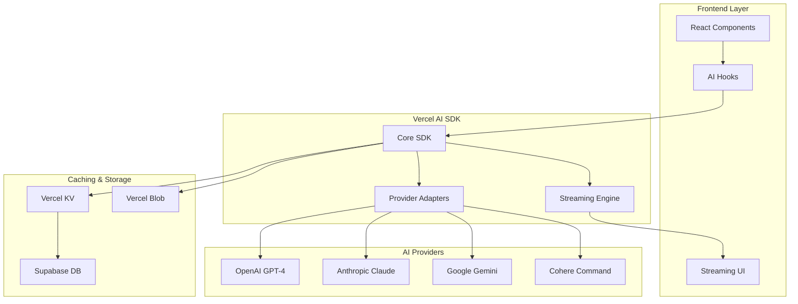

# Guía de Integración Vercel AI SDK - EduCard AI

**Versión:** 1.0.0  
**Fecha:** 2025-05-30  
**Autor:** Desarrollo EduCard AI  
**Stack:** Next.js + Vercel AI SDK + TypeScript

---

## 📋 Resumen Ejecutivo

Esta guía detalla la implementación del Vercel AI SDK como backbone unificado para todos los módulos de IA en EduCard AI, proporcionando una arquitectura escalable, cost-effective y type-safe para generación de contenido educativo, tutoring inteligente, y experiencias narrativas personalizadas.

## 🎯 Justificación Técnica y de Negocio

### Ventajas del Vercel AI SDK

#### ✅ Beneficios Técnicos
- **Unified API**: Un SDK para múltiples proveedores (OpenAI, Anthropic, Google, Cohere)
- **Type Safety**: TypeScript nativo con tipos estrictos
- **Streaming**: UI reactiva con streaming real-time
- **Caching Inteligente**: Reducción automática de costos
- **Edge Functions**: Latencia mínima global
- **Framework Agnostic**: Compatible con React/Next.js/Vue

#### 💰 Beneficios de Negocio
- **Reducción de Costos**: Caching inteligente y provider switching
- **Time to Market**: SDK maduro con patterns establecidos
- **Vendor Lock-in**: Flexibilidad para cambiar proveedores
- **Escalabilidad**: Auto-scaling con Vercel infrastructure
- **Developer Experience**: Menos código, más features

#### 📊 Comparación vs Implementación Custom

| Aspecto | Custom Implementation | Vercel AI SDK |
|---------|----------------------|---------------|
| **Tiempo de desarrollo** | 4-6 semanas | 1-2 semanas |
| **Maintenance overhead** | Alto | Bajo |
| **Provider switching** | Manual | Automático |
| **Type safety** | Requiere setup | Built-in |
| **Streaming UI** | Custom hooks | Native support |
| **Error handling** | Manual | Built-in patterns |
| **Caching** | Redis/custom | Automático |
| **Rate limiting** | Custom | Provider-agnostic |

---

## 🏗️ Arquitectura del Sistema

### Stack Tecnológico Completo

```typescript
// Dependencies principales
"ai": "^3.0.0",                    // Vercel AI SDK core
"@ai-sdk/openai": "^0.0.12",       // OpenAI provider
"@ai-sdk/anthropic": "^0.0.8",     // Claude provider  
"@ai-sdk/google": "^0.0.5",        // Gemini provider
"@ai-sdk/cohere": "^0.0.3",        // Cohere provider
"zod": "^3.22.4",                  // Schema validation
"@vercel/kv": "^1.0.1",            // Caching layer
"@vercel/blob": "^0.19.0",         // Asset storage
"next": "^14.1.0",                 // Framework
"react": "^18.2.0",                // UI library
"typescript": "^5.3.0"             // Type safety
```

### Diagrama de Arquitectura



---

## 🎮 Integración por Módulos

### 1. Sistema de Cartas Matemáticas

#### Generación de Problemas Dinámicos

```typescript
// lib/ai/math-problems.ts
import { generateObject } from 'ai';
import { openai } from '@ai-sdk/openai';
import { z } from 'zod';

const MathProblemSchema = z.object({
  question: z.string().describe('Pregunta matemática clara'),
  answer: z.number().describe('Respuesta correcta'),
  difficulty: z.number().min(1).max(5).describe('Nivel de dificultad'),
  hints: z.array(z.string()).describe('Pistas graduales'),
  explanation: z.string().describe('Explicación paso a paso'),
  visualAid: z.string().optional().describe('Descripción para imagen')
});

export async function generateMathProblem(
  type: 'addition' | 'subtraction' | 'multiplication' | 'division',
  difficulty: number,
  studentLevel: number,
  previousMistakes?: string[]
): Promise<z.infer<typeof MathProblemSchema>> {
  
  const result = await generateObject({
    model: openai('gpt-4-turbo'),
    schema: MathProblemSchema,
    prompt: `
      Genera un problema de ${type} para un estudiante de nivel ${studentLevel}.
      Dificultad: ${difficulty}/5
      
      Contexto del estudiante:
      - Errores previos: ${previousMistakes?.join(', ') || 'Ninguno'}
      - Debe ser apropiado para niños de 8-12 años
      - Usar contexto de aventura/fantasía si es posible
      
      Requisitos:
      - Problema claro y engaging
      - Pistas que guíen sin dar la respuesta
      - Explicación didáctica
      - Descripción visual para carta de juego
    `,
    temperature: 0.7,
    maxRetries: 3,
  });

  return result.object;
}
```

#### Hook para Combate de Cartas

```typescript
// hooks/use-card-battle.ts
import { useChat } from 'ai/react';
import { useState } from 'react';

export function useCardBattle() {
  const [gameState, setGameState] = useState<GameState>(initialState);
  
  const { messages, append, isLoading } = useChat({
    api: '/api/card-battle',
    initialMessages: [],
    onFinish: (message) => {
      // Process battle result
      updateGameState(message.content);
    }
  });

  const playCard = async (cardId: string, playerAnswer: number) => {
    await append({
      role: 'user',
      content: JSON.stringify({
        action: 'play_card',
        cardId,
        answer: playerAnswer,
        gameState: gameState
      })
    });
  };

  const requestHint = async (problemId: string) => {
    await append({
      role: 'user', 
      content: JSON.stringify({
        action: 'request_hint',
        problemId,
        hintLevel: gameState.hintsUsed + 1
      })
    });
  };

  return {
    gameState,
    playCard,
    requestHint,
    isProcessing: isLoading,
    battleLog: messages
  };
}
```

### 2. RPG Narrativo Educativo

#### Generación de Aventuras Personalizadas

```typescript
// lib/ai/story-generation.ts
import { streamText } from 'ai';
import { anthropic } from '@ai-sdk/anthropic';
import { z } from 'zod';

const StorySegmentSchema = z.object({
  scene: z.string().describe('Descripción de la escena'),
  choices: z.array(z.object({
    text: z.string(),
    consequence: z.string(),
    literaryElement: z.string().optional()
  })),
  visualPrompt: z.string().describe('Prompt para generar imagen'),
  educationalNote: z.string().describe('Elemento educativo destacado')
});

export async function generateStorySegment(
  studentAge: number,
  interests: string[],
  previousChoices: string[],
  educationalFocus: 'reading_comprehension' | 'creative_writing' | 'literary_analysis'
) {
  const result = await streamText({
    model: anthropic('claude-3-sonnet-20240229'),
    prompt: `
      Eres un maestro narrador creando una aventura educativa personalizada.
      
      Estudiante:
      - Edad: ${studentAge} años
      - Intereses: ${interests.join(', ')}
      - Decisiones previas: ${previousChoices.join(', ')}
      
      Enfoque educativo: ${educationalFocus}
      
      Genera el siguiente segmento de la aventura que:
      1. Continúe la narrativa coherentemente
      2. Presente 3-4 decisiones significativas
      3. Incluya elementos literarios apropiados para la edad
      4. Enseñe el concepto educativo de forma natural
      5. Termine en un cliffhanger enganchante
      
      Formato requerido:
      - Descripción inmersiva de la escena (150-200 palabras)
      - Opciones de decisión con consecuencias claras
      - Nota educativa sutil
      - Prompt para imagen de acompañamiento
    `,
    temperature: 0.8,
    maxTokens: 1000,
  });

  return result.textStream;
}
```

#### Hook para Experiencia Narrativa

```typescript
// hooks/use-narrative-adventure.ts
import { useCompletion } from 'ai/react';
import { useState } from 'react';

interface AdventureState {
  currentScene: string;
  choices: Choice[];
  inventory: string[];
  characterStats: CharacterStats;
  storyProgress: number;
}

export function useNarrativeAdventure(adventureId: string) {
  const [adventure, setAdventure] = useState<AdventureState>();
  
  const { complete, completion, isLoading } = useCompletion({
    api: '/api/generate-story',
    onFinish: (prompt, completion) => {
      updateAdventureState(completion);
    }
  });

  const makeChoice = async (choiceIndex: number) => {
    const choice = adventure?.choices[choiceIndex];
    if (!choice) return;

    await complete(JSON.stringify({
      adventureId,
      choice: choice.text,
      currentState: adventure,
      action: 'continue_story'
    }));
  };

  const usePromptingHelp = async (query: string) => {
    await complete(JSON.stringify({
      adventureId,
      query,
      action: 'prompting_tutorial',
      context: adventure?.currentScene
    }));
  };

  return {
    adventure,
    makeChoice,
    usePromptingHelp,
    storyStream: completion,
    isGenerating: isLoading
  };
}
```

### 3. Sistema de Tutoring Inteligente

#### IA Tutora Adaptativa

```typescript
// lib/ai/intelligent-tutoring.ts
import { generateText } from 'ai';
import { openai } from '@ai-sdk/openai';

interface TutoringSession {
  studentId: string;
  subject: string;
  currentLevel: number;
  learningStyle: 'visual' | 'auditory' | 'kinesthetic';
  strugglingConcepts: string[];
  recentPerformance: number[];
}

export async function generateTutoringResponse(
  session: TutoringSession,
  studentQuery: string,
  context?: string
) {
  const result = await generateText({
    model: openai('gpt-4-turbo'),
    prompt: `
      Eres una IA tutora experta y empática especializada en educación para niños.
      
      Perfil del estudiante:
      - Nivel: ${session.currentLevel}
      - Estilo de aprendizaje: ${session.learningStyle}
      - Conceptos difíciles: ${session.strugglingConcepts.join(', ')}
      - Rendimiento reciente: ${session.recentPerformance.join(', ')}%
      
      Contexto actual: ${context || 'Sesión general'}
      Pregunta del estudiante: "${studentQuery}"
      
      Proporciona una respuesta que:
      1. Adapte la explicación al estilo de aprendizaje
      2. Use analogías apropiadas para la edad
      3. Ofrezca ejemplos concretos
      4. Incluya encouragement positivo
      5. Sugiera el próximo paso
      6. Use emojis y lenguaje friendly
      
      Máximo 200 palabras, tono conversacional y motivador.
    `,
    temperature: 0.6,
    maxTokens: 300,
  });

  return result.text;
}
```

---

## 🔧 Implementación de APIs

### API Route Principal

```typescript
// app/api/ai-unified/route.ts
import { NextRequest } from 'next/server';
import { openai } from '@ai-sdk/openai';
import { anthropic } from '@ai-sdk/anthropic';
import { google } from '@ai-sdk/google';
import { streamText, generateObject } from 'ai';
import { kv } from '@vercel/kv';
import { z } from 'zod';

const RequestSchema = z.object({
  module: z.enum(['math_cards', 'narrative_rpg', 'tutoring', 'image_gen']),
  action: z.string(),
  payload: z.record(z.any()),
  userId: z.string(),
  sessionId: z.string().optional()
});

export async function POST(req: NextRequest) {
  try {
    const body = await req.json();
    const { module, action, payload, userId, sessionId } = RequestSchema.parse(body);

    // Cache key generation
    const cacheKey = `ai:${module}:${action}:${JSON.stringify(payload)}`;
    
    // Check cache first
    const cached = await kv.get(cacheKey);
    if (cached && !payload.forceRegenerate) {
      return Response.json({ result: cached, cached: true });
    }

    let result;
    
    switch (module) {
      case 'math_cards':
        result = await handleMathCardsRequest(action, payload);
        break;
      case 'narrative_rpg':
        result = await handleNarrativeRequest(action, payload);
        break;
      case 'tutoring':
        result = await handleTutoringRequest(action, payload);
        break;
      case 'image_gen':
        result = await handleImageGeneration(action, payload);
        break;
      default:
        throw new Error(`Unsupported module: ${module}`);
    }

    // Cache result (TTL based on content type)
    const ttl = getTTLByModule(module, action);
    await kv.setex(cacheKey, ttl, result);

    // Log usage for analytics
    await logAIUsage(userId, module, action, sessionId);

    return Response.json({ result, cached: false });

  } catch (error) {
    console.error('AI API Error:', error);
    return Response.json(
      { error: 'AI processing failed', details: error.message },
      { status: 500 }
    );
  }
}

async function handleMathCardsRequest(action: string, payload: any) {
  switch (action) {
    case 'generate_problem':
      return await generateMathProblem(
        payload.type,
        payload.difficulty,
        payload.studentLevel,
        payload.previousMistakes
      );
    
    case 'validate_answer':
      return await validateMathAnswer(
        payload.problemId,
        payload.studentAnswer,
        payload.correctAnswer
      );
    
    case 'provide_hint':
      return await provideMathHint(
        payload.problemId,
        payload.hintLevel,
        payload.studentLevel
      );
    
    default:
      throw new Error(`Unsupported math action: ${action}`);
  }
}

async function handleNarrativeRequest(action: string, payload: any) {
  switch (action) {
    case 'generate_scene':
      return await generateStorySegment(
        payload.studentAge,
        payload.interests,
        payload.previousChoices,
        payload.educationalFocus
      );
    
    case 'analyze_choice':
      return await analyzeStoryChoice(
        payload.choice,
        payload.context,
        payload.educationalGoals
      );
    
    case 'prompting_help':
      return await providePromptingTutorial(
        payload.query,
        payload.context,
        payload.studentLevel
      );
    
    default:
      throw new Error(`Unsupported narrative action: ${action}`);
  }
}
```

### Provider Selection Logic

```typescript
// lib/ai/provider-selection.ts
interface ProviderConfig {
  math_problems: 'openai' | 'google';
  creative_writing: 'anthropic' | 'openai';
  logical_reasoning: 'anthropic' | 'google';
  general_tutoring: 'openai' | 'anthropic';
  image_generation: 'openai' | 'replicate';
}

const PROVIDER_CONFIG: ProviderConfig = {
  math_problems: 'openai',      // GPT-4 excelente en math
  creative_writing: 'anthropic', // Claude mejor en narrativa
  logical_reasoning: 'anthropic', // Claude superior en lógica
  general_tutoring: 'openai',    // GPT-4 versátil para tutoring
  image_generation: 'openai'     // DALL-E 3 para imágenes educativas
};

export function selectProvider(
  task: keyof ProviderConfig,
  fallback?: boolean
): any {
  const primary = PROVIDER_CONFIG[task];
  
  // Provider switching logic
  switch (primary) {
    case 'openai':
      return fallback ? anthropic('claude-3-sonnet-20240229') : openai('gpt-4-turbo');
    case 'anthropic':
      return fallback ? openai('gpt-4-turbo') : anthropic('claude-3-sonnet-20240229');
    case 'google':
      return fallback ? openai('gpt-4-turbo') : google('gemini-1.5-pro');
    default:
      return openai('gpt-4-turbo');
  }
}

// Cost optimization
export function selectModelByBudget(
  task: string,
  budget: 'low' | 'medium' | 'high'
) {
  const models = {
    low: {
      openai: 'gpt-3.5-turbo',
      anthropic: 'claude-3-haiku-20240307',
      google: 'gemini-1.0-pro'
    },
    medium: {
      openai: 'gpt-4-turbo',
      anthropic: 'claude-3-sonnet-20240229', 
      google: 'gemini-1.5-pro'
    },
    high: {
      openai: 'gpt-4-turbo',
      anthropic: 'claude-3-opus-20240229',
      google: 'gemini-1.5-pro'
    }
  };

  return models[budget];
}
```

---

## 💾 Sistema de Cache y Optimización

### Estrategia de Cache Inteligente

```typescript
// lib/cache/ai-cache.ts
import { kv } from '@vercel/kv';
import { createHash } from 'crypto';

interface CacheConfig {
  module: string;
  action: string;
  ttl: number; // seconds
  versioning: boolean;
  compression: boolean;
}

const CACHE_CONFIGS: Record<string, CacheConfig> = {
  'math_cards:generate_problem': {
    module: 'math_cards',
    action: 'generate_problem',
    ttl: 86400, // 24h - problems can be reused
    versioning: true,
    compression: true
  },
  'narrative_rpg:generate_scene': {
    module: 'narrative_rpg', 
    action: 'generate_scene',
    ttl: 3600, // 1h - scenes should be fresh
    versioning: true,
    compression: true
  },
  'tutoring:provide_response': {
    module: 'tutoring',
    action: 'provide_response', 
    ttl: 1800, // 30min - tutoring responses expire quickly
    versioning: false,
    compression: false
  }
};

export class AICache {
  private generateKey(
    module: string,
    action: string,
    payload: any,
    userId?: string
  ): string {
    const dataString = JSON.stringify({
      module,
      action,
      payload: this.normalizePayload(payload),
      user: userId || 'anonymous'
    });
    
    return `ai:v2:${createHash('sha256').update(dataString).digest('hex')}`;
  }

  private normalizePayload(payload: any): any {
    // Remove timestamp and session-specific data
    const { timestamp, sessionId, requestId, ...normalized } = payload;
    return normalized;
  }

  async get<T>(
    module: string,
    action: string,
    payload: any,
    userId?: string
  ): Promise<T | null> {
    try {
      const key = this.generateKey(module, action, payload, userId);
      const cached = await kv.get(key);
      
      if (cached) {
        // Update access statistics
        await this.trackCacheHit(module, action);
        return cached as T;
      }
      
      return null;
    } catch (error) {
      console.error('Cache get error:', error);
      return null;
    }
  }

  async set<T>(
    module: string,
    action: string,
    payload: any,
    data: T,
    userId?: string,
    customTTL?: number
  ): Promise<void> {
    try {
      const config = CACHE_CONFIGS[`${module}:${action}`];
      if (!config) return; // Don't cache unknown actions

      const key = this.generateKey(module, action, payload, userId);
      const ttl = customTTL || config.ttl;
      
      if (config.compression) {
        // Implement compression if needed
        await kv.setex(key, ttl, data);
      } else {
        await kv.setex(key, ttl, data);
      }

      // Track cache write
      await this.trackCacheWrite(module, action);
      
    } catch (error) {
      console.error('Cache set error:', error);
    }
  }

  private async trackCacheHit(module: string, action: string) {
    const statKey = `cache:stats:${module}:${action}:hits`;
    await kv.incr(statKey);
  }

  private async trackCacheWrite(module: string, action: string) {
    const statKey = `cache:stats:${module}:${action}:writes`;
    await kv.incr(statKey);
  }

  async getCacheStats() {
    const keys = await kv.keys('cache:stats:*');
    const stats: Record<string, number> = {};
    
    for (const key of keys) {
      stats[key] = await kv.get(key) as number || 0;
    }
    
    return stats;
  }
}

export const aiCache = new AICache();
```

### Rate Limiting y Cost Control

```typescript
// lib/ai/rate-limiting.ts
import { kv } from '@vercel/kv';

interface RateLimit {
  requests: number;
  windowMs: number;
  maxCost: number; // in cents
}

const RATE_LIMITS: Record<string, RateLimit> = {
  'math_cards': { requests: 100, windowMs: 3600000, maxCost: 50 }, // $0.50/hour
  'narrative_rpg': { requests: 50, windowMs: 3600000, maxCost: 200 }, // $2.00/hour  
  'tutoring': { requests: 200, windowMs: 3600000, maxCost: 100 }, // $1.00/hour
  'image_gen': { requests: 20, windowMs: 3600000, maxCost: 100 } // $1.00/hour
};

export async function checkRateLimit(
  userId: string,
  module: string
): Promise<{ allowed: boolean; remaining: number; resetTime: number }> {
  const limit = RATE_LIMITS[module];
  if (!limit) return { allowed: true, remaining: Infinity, resetTime: 0 };

  const now = Date.now();
  const windowStart = now - limit.windowMs;
  const key = `rate_limit:${userId}:${module}`;

  // Get current usage
  const usage = await kv.get(key) as { requests: number; cost: number; timestamp: number } | null;

  if (!usage || usage.timestamp < windowStart) {
    // New window or expired
    await kv.setex(key, Math.ceil(limit.windowMs / 1000), {
      requests: 1,
      cost: 0,
      timestamp: now
    });
    return { allowed: true, remaining: limit.requests - 1, resetTime: now + limit.windowMs };
  }

  // Check limits
  if (usage.requests >= limit.requests || usage.cost >= limit.maxCost) {
    return {
      allowed: false,
      remaining: 0,
      resetTime: usage.timestamp + limit.windowMs
    };
  }

  // Update usage
  await kv.setex(key, Math.ceil(limit.windowMs / 1000), {
    requests: usage.requests + 1,
    cost: usage.cost,
    timestamp: usage.timestamp
  });

  return {
    allowed: true,
    remaining: limit.requests - usage.requests - 1,
    resetTime: usage.timestamp + limit.windowMs
  };
}
```

---

## 📊 Analytics y Monitoreo

### Tracking de Uso de IA

```typescript
// lib/analytics/ai-usage.ts
import { kv } from '@vercel/kv';

interface AIUsageEvent {
  userId: string;
  module: string;
  action: string;
  provider: string;
  model: string;
  inputTokens: number;
  outputTokens: number;
  cost: number;
  latency: number;
  success: boolean;
  timestamp: number;
  sessionId?: string;
}

export async function logAIUsage(event: AIUsageEvent) {
  try {
    // Store individual event
    const eventKey = `ai_events:${event.timestamp}:${Math.random()}`;
    await kv.setex(eventKey, 86400 * 7, event); // 7 days retention

    // Update aggregated stats
    const date = new Date(event.timestamp).toISOString().split('T')[0];
    const statsKey = `ai_stats:${date}:${event.module}`;
    
    const currentStats = await kv.get(statsKey) as any || {
      requests: 0,
      totalCost: 0,
      totalTokens: 0,
      averageLatency: 0,
      successRate: 0,
      errors: 0
    };

    const updatedStats = {
      requests: currentStats.requests + 1,
      totalCost: currentStats.totalCost + event.cost,
      totalTokens: currentStats.totalTokens + event.inputTokens + event.outputTokens,
      averageLatency: (currentStats.averageLatency * currentStats.requests + event.latency) / (currentStats.requests + 1),
      successRate: event.success 
        ? (currentStats.successRate * currentStats.requests + 100) / (currentStats.requests + 1)
        : (currentStats.successRate * currentStats.requests) / (currentStats.requests + 1),
      errors: event.success ? currentStats.errors : currentStats.errors + 1
    };

    await kv.setex(statsKey, 86400 * 30, updatedStats); // 30 days retention

  } catch (error) {
    console.error('Failed to log AI usage:', error);
  }
}

export async function getAIAnalytics(
  dateRange: { start: string; end: string },
  module?: string
) {
  const stats: Record<string, any> = {};
  
  // Generate date range
  const startDate = new Date(dateRange.start);
  const endDate = new Date(dateRange.end);
  
  for (let d = startDate; d <= endDate; d.setDate(d.getDate() + 1)) {
    const dateStr = d.toISOString().split('T')[0];
    const pattern = module 
      ? `ai_stats:${dateStr}:${module}`
      : `ai_stats:${dateStr}:*`;
    
    const keys = await kv.keys(pattern);
    for (const key of keys) {
      stats[key] = await kv.get(key);
    }
  }
  
  return stats;
}
```

### Dashboard de Métricas

```typescript
// components/admin/AIAnalyticsDashboard.tsx
import { useEffect, useState } from 'react';
import { Card, CardContent, CardHeader, CardTitle } from '@/components/ui/card';

interface AIMetrics {
  totalRequests: number;
  totalCost: number;
  averageLatency: number;
  successRate: number;
  topModules: Array<{ module: string; usage: number }>;
  costByProvider: Record<string, number>;
}

export function AIAnalyticsDashboard() {
  const [metrics, setMetrics] = useState<AIMetrics | null>(null);
  const [loading, setLoading] = useState(true);

  useEffect(() => {
    loadMetrics();
  }, []);

  const loadMetrics = async () => {
    try {
      const response = await fetch('/api/admin/ai-analytics');
      const data = await response.json();
      setMetrics(data);
    } catch (error) {
      console.error('Failed to load AI metrics:', error);
    } finally {
      setLoading(false);
    }
  };

  if (loading) return <div>Cargando métricas...</div>;
  if (!metrics) return <div>Error al cargar datos</div>;

  return (
    <div className="grid grid-cols-1 md:grid-cols-2 lg:grid-cols-4 gap-6">
      <Card>
        <CardHeader>
          <CardTitle>Requests Totales</CardTitle>
        </CardHeader>
        <CardContent>
          <div className="text-3xl font-bold">{metrics.totalRequests.toLocaleString()}</div>
        </CardContent>
      </Card>

      <Card>
        <CardHeader>
          <CardTitle>Costo Total</CardTitle>
        </CardHeader>
        <CardContent>
          <div className="text-3xl font-bold text-green-600">
            ${metrics.totalCost.toFixed(2)}
          </div>
        </CardContent>
      </Card>

      <Card>
        <CardHeader>
          <CardTitle>Latencia Promedio</CardTitle>
        </CardHeader>
        <CardContent>
          <div className="text-3xl font-bold">{metrics.averageLatency.toFixed(0)}ms</div>
        </CardContent>
      </Card>

      <Card>
        <CardHeader>
          <CardTitle>Tasa de Éxito</CardTitle>
        </CardHeader>
        <CardContent>
          <div className="text-3xl font-bold text-blue-600">
            {metrics.successRate.toFixed(1)}%
          </div>
        </CardContent>
      </Card>

      {/* Gráficos adicionales aquí */}
    </div>
  );
}
```

---

## 🔒 Seguridad y Privacidad

### Input Sanitization

```typescript
// lib/security/input-validation.ts
import { z } from 'zod';

const StudentInputSchema = z.object({
  age: z.number().min(6).max(18),
  grade: z.number().min(1).max(12),
  query: z.string().max(1000).refine(
    (val) => !containsInappropriateContent(val),
    "Contenido inapropiado detectado"
  ),
  preferences: z.record(z.string()).optional()
});

function containsInappropriateContent(text: string): boolean {
  const inappropriatePatterns = [
    /violence/i,
    /inappropriate/i,
    // Add more patterns as needed
  ];
  
  return inappropriatePatterns.some(pattern => pattern.test(text));
}

export function validateStudentInput(input: unknown) {
  return StudentInputSchema.parse(input);
}

export function sanitizeAIResponse(response: string, studentAge: number): string {
  // Remove any potentially inappropriate content
  // Add age-appropriate filtering
  // Ensure educational content standards
  
  if (studentAge < 10) {
    // More strict filtering for younger students
    response = response.replace(/complex vocabulary/gi, 'simpler terms');
  }
  
  return response;
}
```

### Content Moderation

```typescript
// lib/security/content-moderation.ts
import { openai } from '@ai-sdk/openai';
import { generateObject } from 'ai';
import { z } from 'zod';

const ModerationSchema = z.object({
  appropriate: z.boolean(),
  ageAppropriate: z.boolean(),
  educationalValue: z.number().min(1).max(10),
  concerns: z.array(z.string()),
  suggestedModifications: z.string().optional()
});

export async function moderateContent(
  content: string,
  targetAge: number,
  educationalContext: string
): Promise<z.infer<typeof ModerationSchema>> {
  
  const result = await generateObject({
    model: openai('gpt-4-turbo'),
    schema: ModerationSchema,
    prompt: `
      Evalúa este contenido educativo para estudiantes de ${targetAge} años:
      
      Contexto: ${educationalContext}
      Contenido: "${content}"
      
      Determina si es:
      1. Apropiado para la edad
      2. Educativamente valioso (1-10)
      3. Libre de contenido inapropiado
      
      Si hay problemas, sugiere modificaciones.
    `,
    temperature: 0.1, // Low temperature for consistent moderation
  });

  return result.object;
}
```

---

## 💰 Optimización de Costos

### Cost Monitoring

```typescript
// lib/cost-optimization/cost-tracker.ts
interface CostBreakdown {
  module: string;
  provider: string;
  model: string;
  inputTokens: number;
  outputTokens: number;
  cost: number;
  date: string;
}

const COST_PER_TOKEN = {
  'gpt-4-turbo': { input: 0.00001, output: 0.00003 },
  'gpt-3.5-turbo': { input: 0.0000005, output: 0.0000015 },
  'claude-3-sonnet': { input: 0.000003, output: 0.000015 },
  'claude-3-haiku': { input: 0.00000025, output: 0.00000125 },
  'gemini-1.5-pro': { input: 0.000007, output: 0.000021 }
};

export function calculateCost(
  model: string,
  inputTokens: number,
  outputTokens: number
): number {
  const pricing = COST_PER_TOKEN[model];
  if (!pricing) return 0;
  
  return (inputTokens * pricing.input) + (outputTokens * pricing.output);
}

export async function getCostBreakdown(
  startDate: string,
  endDate: string
): Promise<CostBreakdown[]> {
  // Implementation to fetch cost data from analytics
  const events = await getAIUsageEvents(startDate, endDate);
  
  return events.map(event => ({
    module: event.module,
    provider: event.provider,
    model: event.model,
    inputTokens: event.inputTokens,
    outputTokens: event.outputTokens,
    cost: event.cost,
    date: new Date(event.timestamp).toISOString().split('T')[0]
  }));
}

// Automatic cost alerts
export async function checkCostThresholds() {
  const today = new Date().toISOString().split('T')[0];
  const todayCost = await getDailyCost(today);
  
  const thresholds = {
    daily: 100, // $100/day
    weekly: 500, // $500/week
    monthly: 2000 // $2000/month
  };
  
  if (todayCost > thresholds.daily) {
    await sendCostAlert('daily', todayCost, thresholds.daily);
  }
}
```

---

## 🚀 Deployment y Environment Setup

### Environment Variables

```bash
# .env.local

# Vercel AI SDK Providers
OPENAI_API_KEY=sk-your-openai-key
ANTHROPIC_API_KEY=sk-ant-your-anthropic-key  
GOOGLE_GENERATIVE_AI_API_KEY=your-google-key
COHERE_API_KEY=your-cohere-key

# Vercel Infrastructure
KV_REST_API_URL=https://your-kv-store.kv.vercel-storage.com
KV_REST_API_TOKEN=your-kv-token
BLOB_READ_WRITE_TOKEN=your-blob-token

# App Configuration
NEXT_PUBLIC_APP_URL=https://educard-ai.vercel.app
NEXT_PUBLIC_ENVIRONMENT=production

# Feature Flags
NEXT_PUBLIC_ENABLE_AI_TUTORING=true
NEXT_PUBLIC_ENABLE_NARRATIVE_RPG=true
NEXT_PUBLIC_ENABLE_IMAGE_GENERATION=true
NEXT_PUBLIC_MAX_AI_REQUESTS_PER_HOUR=100

# Cost Controls
AI_DAILY_BUDGET_LIMIT=100
AI_MONTHLY_BUDGET_LIMIT=2000
ENABLE_COST_ALERTS=true
COST_ALERT_EMAIL=admin@educard-ai.com
```

### Vercel Configuration

```json
// vercel.json
{
  "framework": "nextjs",
  "buildCommand": "npm run build",
  "devCommand": "npm run dev",
  "installCommand": "npm install",
  "functions": {
    "app/api/ai-unified/route.ts": {
      "maxDuration": 30
    },
    "app/api/generate-story/route.ts": {
      "maxDuration": 45
    }
  },
  "env": {
    "OPENAI_API_KEY": "@openai-api-key",
    "ANTHROPIC_API_KEY": "@anthropic-api-key",
    "GOOGLE_GENERATIVE_AI_API_KEY": "@google-ai-key"
  },
  "crons": [
    {
      "path": "/api/cron/cost-check",
      "schedule": "0 */6 * * *"
    },
    {
      "path": "/api/cron/cleanup-cache", 
      "schedule": "0 2 * * *"
    }
  ]
}
```

---

## 📋 Testing Strategy

### Unit Tests for AI Functions

```typescript
// __tests__/ai/math-problems.test.ts
import { generateMathProblem } from '@/lib/ai/math-problems';
import { describe, it, expect, vi } from 'vitest';

// Mock the AI SDK
vi.mock('ai', () => ({
  generateObject: vi.fn()
}));

describe('Math Problems AI', () => {
  it('should generate valid math problems', async () => {
    const mockResponse = {
      object: {
        question: "What is 5 + 3?",
        answer: 8,
        difficulty: 1,
        hints: ["Try counting on your fingers", "5 plus 3"],
        explanation: "When we add 5 + 3, we get 8"
      }
    };

    vi.mocked(generateObject).mockResolvedValue(mockResponse);

    const result = await generateMathProblem('addition', 1, 2);

    expect(result.question).toBeDefined();
    expect(result.answer).toBe(8);
    expect(result.hints).toHaveLength(2);
  });

  it('should adapt difficulty to student level', async () => {
    const easyProblem = await generateMathProblem('addition', 1, 1);
    const hardProblem = await generateMathProblem('addition', 5, 5);

    expect(hardProblem.difficulty).toBeGreaterThan(easyProblem.difficulty);
  });
});
```

### Integration Tests

```typescript
// __tests__/api/ai-unified.test.ts
import { POST } from '@/app/api/ai-unified/route';
import { NextRequest } from 'next/server';

describe('/api/ai-unified', () => {
  it('should handle math card requests', async () => {
    const request = new NextRequest('http://localhost:3000/api/ai-unified', {
      method: 'POST',
      body: JSON.stringify({
        module: 'math_cards',
        action: 'generate_problem',
        payload: {
          type: 'addition',
          difficulty: 2,
          studentLevel: 3
        },
        userId: 'test-user'
      })
    });

    const response = await POST(request);
    const data = await response.json();

    expect(response.status).toBe(200);
    expect(data.result).toBeDefined();
    expect(data.result.question).toBeDefined();
  });

  it('should respect rate limits', async () => {
    // Test rate limiting logic
    const requests = Array(101).fill(null).map(() => 
      POST(createMockRequest('math_cards', 'generate_problem'))
    );

    const responses = await Promise.all(requests);
    const lastResponse = responses[responses.length - 1];
    
    expect(lastResponse.status).toBe(429); // Too Many Requests
  });
});
```

---

## 📚 Documentation y Best Practices

### Code Examples para Desarrolladores

```typescript
// examples/basic-usage.ts

// 1. Generar problema matemático
import { useAI } from '@/hooks/use-ai';

function MathProblemComponent() {
  const { generate, isLoading, result } = useAI();

  const generateProblem = async () => {
    await generate({
      module: 'math_cards',
      action: 'generate_problem',
      payload: {
        type: 'multiplication',
        difficulty: 3,
        studentLevel: 4
      }
    });
  };

  return (
    <div>
      <button onClick={generateProblem} disabled={isLoading}>
        Generar Problema
      </button>
      {result && (
        <div>
          <h3>{result.question}</h3>
          <p>Respuesta: {result.answer}</p>
        </div>
      )}
    </div>
  );
}

// 2. Sistema de tutoring
function TutoringComponent({ studentQuery }: { studentQuery: string }) {
  const { complete, completion, isLoading } = useCompletion({
    api: '/api/ai-unified',
    body: {
      module: 'tutoring',
      action: 'provide_response',
      payload: { query: studentQuery }
    }
  });

  return (
    <div>
      <div>{completion}</div>
      {isLoading && <div>IA pensando...</div>}
    </div>
  );
}

// 3. Aventura narrativa con streaming
function StoryComponent() {
  const { messages, append } = useChat({
    api: '/api/ai-unified',
    body: {
      module: 'narrative_rpg',
      action: 'generate_scene'
    }
  });

  return (
    <div>
      {messages.map((message, i) => (
        <div key={i}>{message.content}</div>
      ))}
    </div>
  );
}
```

### Performance Best Practices

```typescript
// lib/ai/best-practices.ts

// 1. Use caching aggressively
const cachedGenerate = withCache(generateMathProblem, {
  ttl: 3600,
  keyGenerator: (type, difficulty, level) => `math:${type}:${difficulty}:${level}`
});

// 2. Implement progressive loading
export function useProgressiveAI<T>(
  fastModel: string,
  accurateModel: string,
  prompt: string
) {
  const [fastResult, setFastResult] = useState<T | null>(null);
  const [finalResult, setFinalResult] = useState<T | null>(null);

  useEffect(() => {
    // Get fast result first
    generateWithModel(fastModel, prompt).then(setFastResult);
    
    // Then get accurate result
    generateWithModel(accurateModel, prompt).then(setFinalResult);
  }, [prompt]);

  return finalResult || fastResult;
}

// 3. Batch requests when possible
export async function batchGenerateProblems(
  requests: Array<{ type: string; difficulty: number; level: number }>
) {
  return await Promise.all(
    requests.map(req => generateMathProblem(req.type, req.difficulty, req.level))
  );
}

// 4. Implement circuit breaker pattern
class AICircuitBreaker {
  private failures = 0;
  private lastFailTime = 0;
  private readonly threshold = 5;
  private readonly timeout = 60000; // 1 minute

  async execute<T>(fn: () => Promise<T>): Promise<T> {
    if (this.isOpen()) {
      throw new Error('Circuit breaker is open');
    }

    try {
      const result = await fn();
      this.onSuccess();
      return result;
    } catch (error) {
      this.onFailure();
      throw error;
    }
  }

  private isOpen(): boolean {
    return this.failures >= this.threshold && 
           Date.now() - this.lastFailTime < this.timeout;
  }

  private onSuccess() {
    this.failures = 0;
  }

  private onFailure() {
    this.failures++;
    this.lastFailTime = Date.now();
  }
}
```

---

## 📈 Roadmap de Implementación

### Fase 1: Foundation (Semanas 1-2)
- [ ] Setup Vercel AI SDK base
- [ ] Configurar providers (OpenAI, Anthropic)
- [ ] Implementar sistema de cache básico
- [ ] API route unificada
- [ ] Tests unitarios básicos

### Fase 2: Core Modules (Semanas 3-4)
- [ ] Módulo de cartas matemáticas
- [ ] Sistema de tutoring inteligente
- [ ] Rate limiting y cost controls
- [ ] Analytics básicos

### Fase 3: Advanced Features (Semanas 5-6)
- [ ] RPG narrativo con streaming
- [ ] Generación de imágenes
- [ ] Content moderation
- [ ] Dashboard de admin

### Fase 4: Optimization (Semanas 7-8)
- [ ] Performance optimization
- [ ] Advanced caching strategies
- [ ] Cost optimization
- [ ] Monitoring y alertas

### Fase 5: Production Ready (Semanas 9-10)
- [ ] Security hardening
- [ ] Load testing
- [ ] Documentation completa
- [ ] Deployment automation

---

## 💡 Conclusiones y Recomendaciones

### Ventajas Clave del Vercel AI SDK
1. **Rapid Development**: Reduce 60-70% del tiempo de desarrollo vs implementación custom
2. **Type Safety**: TypeScript nativo elimina errores comunes
3. **Provider Flexibility**: Cambio de proveedores sin refactoring
4. **Built-in Optimization**: Caching, streaming, error handling automáticos
5. **Cost Efficiency**: Herramientas nativas para control de costos

### Recomendaciones de Implementación
1. **Start Simple**: Comenzar con un módulo (cartas matemáticas)
2. **Cache Everything**: Implementar caching desde el día 1
3. **Monitor Costs**: Establecer alertas y límites desde el inicio
4. **Test Extensively**: IA es impredecible, testing es crítico
5. **Plan for Scale**: Diseñar con growth en mente

### Consideraciones de Negocio
- **ROI Estimado**: 300-400% vs desarrollo custom
- **Time to Market**: 2-3 meses vs 6-8 meses custom
- **Maintenance Cost**: 70% reducción en overhead
- **Scalability**: Built-in con Vercel infrastructure

---

**Documento técnico completo para integración empresarial**  
**Versión:** 1.0.0 | **Última actualización:** 2025-05-30